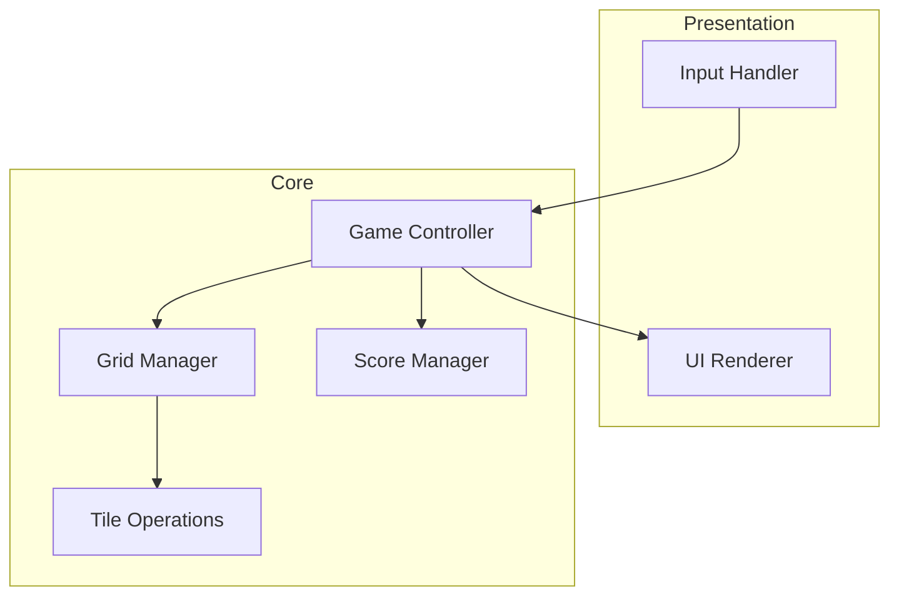

# Design Document: 2048 Game

## Overview

A browser-based 2048 puzzle game implemented as a single-page web application using vanilla HTML, CSS, and JavaScript. The game features a 4x4 grid where players slide tiles using arrow keys, merging matching tiles to reach the 2048 tile.

The architecture separates game logic from presentation, enabling testable core mechanics and a responsive visual interface.

## Architecture



The system follows a Model-View-Controller pattern:
- **Model**: Grid state, tile data, score
- **View**: HTML/CSS rendering with animations
- **Controller**: Game logic coordinating moves, merges, and state transitions

## Components and Interfaces

### Grid Module

Manages the 4x4 grid state and tile positions.

```typescript
interface Cell {
  row: number;
  col: number;
}

interface Tile {
  id: number;
  value: number;
  position: Cell;
  mergedFrom?: [Tile, Tile];
}

interface Grid {
  size: number;
  cells: (Tile | null)[][];
}

// Core grid operations
function createGrid(size: number): Grid;
function getEmptyCells(grid: Grid): Cell[];
function getTileAt(grid: Grid, cell: Cell): Tile | null;
function setTileAt(grid: Grid, cell: Cell, tile: Tile | null): Grid;
function cloneGrid(grid: Grid): Grid;
```

### Tile Operations Module

Handles tile creation, movement, and merging logic.

```typescript
type Direction = 'up' | 'down' | 'left' | 'right';

interface MoveResult {
  grid: Grid;
  moved: boolean;
  scoreGained: number;
  mergedTiles: Tile[];
}

// Tile operations
function createTile(value: number, position: Cell): Tile;
function spawnRandomTile(grid: Grid): Grid;
function moveTiles(grid: Grid, direction: Direction): MoveResult;
function canMerge(tile1: Tile, tile2: Tile): boolean;
function mergeTiles(tile1: Tile, tile2: Tile): Tile;
```

### Game Controller Module

Orchestrates game flow and state management.

```typescript
type GameStatus = 'playing' | 'won' | 'lost';

interface GameState {
  grid: Grid;
  score: number;
  status: GameStatus;
  hasWon: boolean;
}

// Game operations
function initGame(): GameState;
function makeMove(state: GameState, direction: Direction): GameState;
function checkWinCondition(grid: Grid): boolean;
function checkGameOver(grid: Grid): boolean;
function canMove(grid: Grid): boolean;
```

### UI Renderer Module

Handles DOM manipulation and visual updates.

```typescript
interface UIConfig {
  containerSelector: string;
  tileColors: Record<number, string>;
  animationDuration: number;
}

// UI operations
function renderGrid(grid: Grid, container: HTMLElement): void;
function renderScore(score: number, element: HTMLElement): void;
function showMessage(message: string, type: 'win' | 'lose'): void;
function animateTileMove(tile: Tile, from: Cell, to: Cell): void;
function animateTileMerge(tile: Tile): void;
```

### Input Handler Module

Captures and processes user input.

```typescript
type InputCallback = (direction: Direction) => void;

function setupKeyboardInput(callback: InputCallback): void;
function setupTouchInput(element: HTMLElement, callback: InputCallback): void;
```

## Data Models

### Grid Representation

The grid is a 4x4 2D array where each cell contains either a Tile object or null:

```
[
  [Tile|null, Tile|null, Tile|null, Tile|null],
  [Tile|null, Tile|null, Tile|null, Tile|null],
  [Tile|null, Tile|null, Tile|null, Tile|null],
  [Tile|null, Tile|null, Tile|null, Tile|null]
]
```

### Tile Value Progression

Tiles follow powers of 2: 2, 4, 8, 16, 32, 64, 128, 256, 512, 1024, 2048, ...

### Color Mapping

```typescript
const TILE_COLORS: Record<number, string> = {
  2: '#eee4da',
  4: '#ede0c8',
  8: '#f2b179',
  16: '#f59563',
  32: '#f67c5f',
  64: '#f65e3b',
  128: '#edcf72',
  256: '#edcc61',
  512: '#edc850',
  1024: '#edc53f',
  2048: '#edc22e',
};
```

## Movement Algorithm

The movement algorithm processes tiles row-by-row or column-by-column depending on direction:

1. **Extract Line**: Get tiles from a row/column in movement order
2. **Collapse**: Remove empty spaces, sliding tiles together
3. **Merge**: Combine adjacent matching tiles (once per tile per move)
4. **Pad**: Fill remaining spaces with nulls
5. **Apply**: Update grid with new line state

```typescript
function processLine(line: (Tile | null)[]): { tiles: (Tile | null)[]; score: number } {
  // 1. Filter out nulls (collapse)
  const tiles = line.filter(t => t !== null) as Tile[];
  
  // 2. Merge adjacent matching tiles
  const result: (Tile | null)[] = [];
  let score = 0;
  let i = 0;
  
  while (i < tiles.length) {
    if (i + 1 < tiles.length && tiles[i].value === tiles[i + 1].value) {
      const newValue = tiles[i].value * 2;
      result.push(createTile(newValue, tiles[i].position));
      score += newValue;
      i += 2; // Skip both merged tiles
    } else {
      result.push(tiles[i]);
      i++;
    }
  }
  
  // 3. Pad with nulls
  while (result.length < 4) {
    result.push(null);
  }
  
  return { tiles: result, score };
}
```


## Correctness Properties

*A property is a characteristic or behavior that should hold true across all valid executions of a system—essentially, a formal statement about what the system should do. Properties serve as the bridge between human-readable specifications and machine-verifiable correctness guarantees.*

### Property 1: Initial Game State

*For any* newly initialized game, the grid SHALL contain exactly 2 tiles, and the score SHALL be zero.

**Validates: Requirements 1.2, 7.1, 7.2, 7.3**

### Property 2: Spawned Tile Values

*For any* spawned tile, its value SHALL be either 2 or 4 (no other values are valid for spawning).

**Validates: Requirements 1.3**

### Property 3: Movement Collapses to Edge

*For any* grid state and movement direction, after a move all tiles SHALL be positioned against the edge in the movement direction with no empty cells between tiles in that direction.

**Validates: Requirements 2.1, 2.2**

### Property 4: Valid Move Spawns One Tile

*For any* grid state where a move causes at least one tile to change position or merge, exactly one new tile SHALL be spawned in an empty cell.

**Validates: Requirements 2.3**

### Property 5: Invalid Move Preserves State

*For any* grid state and direction where no tile can move or merge, the grid state SHALL remain unchanged (no new tiles spawned, no position changes).

**Validates: Requirements 2.4**

### Property 6: Merge Doubles Value

*For any* two tiles with equal values that collide during a move, they SHALL merge into a single tile with exactly double the original value.

**Validates: Requirements 3.1**

### Property 7: Score Increases by Merged Value

*For any* merge operation, the score SHALL increase by exactly the value of the newly created merged tile.

**Validates: Requirements 3.2**

### Property 8: Single Merge Per Tile Per Move

*For any* tile created by a merge during a move, that tile SHALL NOT merge again in the same move. (e.g., [2,2,2,2] moving left produces [4,4], not [8])

**Validates: Requirements 3.3**

### Property 9: Merge Direction Priority

*For any* row or column with multiple possible merges, tiles closest to the movement direction edge SHALL merge first. (e.g., [2,2,4] moving left produces [4,4], not [2,8])

**Validates: Requirements 3.4**

### Property 10: Win Detection

*For any* grid containing a tile with value 2048 or greater, the win condition SHALL be detected as true.

**Validates: Requirements 5.1**

### Property 11: Game Over Detection

*For any* grid where all cells are occupied AND no two adjacent cells (horizontally or vertically) contain tiles with equal values, the game over condition SHALL be detected as true.

**Validates: Requirements 6.1**

## Error Handling

### Invalid Input Handling

- **Invalid Direction**: Ignore any input that is not a valid direction (up, down, left, right)
- **Input During Animation**: Queue or ignore inputs while animations are in progress
- **Rapid Input**: Debounce rapid key presses to prevent state corruption

### Edge Cases

- **Full Grid**: When grid is full, only allow moves that result in merges
- **No Valid Moves**: Detect and handle game over state gracefully
- **Maximum Tile Value**: Handle tiles beyond 2048 (game continues after win)

### State Recovery

- **Browser Refresh**: Optionally persist game state to localStorage
- **Invalid State**: Reset to new game if corrupted state is detected

## Testing Strategy

### Unit Tests

Unit tests verify specific examples and edge cases:

- Grid initialization creates correct dimensions
- Tile spawning places tiles in valid empty cells
- Movement in each direction works correctly
- Merge logic combines tiles properly
- Score calculation is accurate
- Win/lose detection triggers at correct times
- Edge cases: empty grid moves, full grid handling, maximum merges

### Property-Based Tests

Property-based tests verify universal properties across randomly generated inputs using a PBT library (e.g., fast-check for JavaScript/TypeScript):

- **Minimum 100 iterations** per property test
- Each test references its design document property
- Tag format: **Feature: 2048-game, Property {number}: {property_text}**

Property tests focus on:
- Grid invariants (size, valid positions)
- Movement correctness (collapse, no gaps)
- Merge correctness (value doubling, single merge per move)
- Score consistency (increases match merged values)
- State transitions (valid/invalid moves)

### Test Configuration

```typescript
// Property test configuration
const PBT_CONFIG = {
  numRuns: 100,
  seed: undefined, // Random seed for reproducibility when debugging
};

// Example property test structure
describe('2048 Game Properties', () => {
  it('Property 1: Initial game has exactly 2 tiles', () => {
    fc.assert(
      fc.property(fc.constant(null), () => {
        const game = initGame();
        const tileCount = countTiles(game.grid);
        return tileCount === 2 && game.score === 0;
      }),
      { numRuns: PBT_CONFIG.numRuns }
    );
  });
});
```

### Test Coverage Goals

- All 11 correctness properties implemented as property-based tests
- Unit tests for UI rendering and input handling
- Integration tests for full game flow (start → play → win/lose)
