# Lab 01: Capture learning into Kiro Power


## Overview

Welcome to the Kiro Power workshop! In this hands-on lab, you'll learn how to leverage **Kiro Powers** to debug a web application and understand the value of **context engineering** — the practice of providing AI assistants with the right tools, documentation, and workflows to solve complex problems effectively.

### What You'll Learn

- How to install and use existing Kiro Powers
- How to create custom Kiro Powers for your specific workflows
- How to debug web UI issues using Chrome DevTools through Kiro
- How Kiro Power improves your teams' context engineering in the projects

### Prerequisites

- Kiro IDE installed
- Chrome browser installed

### Time Required

~30 minutes

---

## The Scenario

You've inherited a **2048 game** project that has some UI bugs. The tiles appear misaligned or positioned incorrectly on the game board. Your task is to build a reusable Kiro Powers to identify and fix these visual issues.

The game is built with:
- TypeScript
- Vite (build tool)
- Vanilla CSS

---

## Part 1: Understanding Kiro Powers

### What is a Kiro Power?

A **Kiro Power** is a packaged capability that extends Kiro's abilities. Powers can include:

- **Documentation** (POWER.md) — Context and instructions for the AI
- **Steering files** — Workflow guides for specific tasks
- **MCP Servers** — Tools that Kiro can use to interact with external systems

### Why Context Engineering Matters

Large Language Models (LLMs) are powerful, but they work best when given:

1. **The right tools** — Access to inspect, debug, and interact with systems
2. **Clear documentation** — Understanding of how to use those tools effectively
3. **Workflow guidance** — Step-by-step processes for complex tasks

This is **context engineering** — designing the information and tools that help AI assistants succeed.

---

## Part 2: Install the Power Builder

Before creating our own power, let's install the **Power Builder** — a meta-power that helps you create new powers.

### Step 1: Open the Powers Panel

1. In Kiro, on the left panel
2. Scroll adn find the **Build a Power** power
3. Install it


### Step 2: Try Out the Power Builder

Once installed, you can click select in left panel and click "Try power" to activate the power in the chat.


---

## Part 3: Create the Debug Web UI Power

Now let's create a power specifically for debugging web UI issues using Chrome DevTools.

### Step 3: Create the Debug Web UI Power

Ask Kiro to create a new power:

```text
Use power-builder power to create a "Debug Web UI power" with the Chrome DevTools MCP server chrome-devtools-mcp@latest. Activate this power after UI developments and fixing UI bugs.
```


Check the generated Kiro Power. Usually it is generated in `powers/`

### Step 4: Install and Select Your New Power

After the power is created, install it from the Powers panel:

1. Open the Powers configuration panel
2. Select your newly created **debug-web-ui** power folder


### Step 5: Configure Auto-Approved Actions

After the new Debug Web UI Kiro Power is installed, the Kiro MCP server configurations will show up a new section `powers`. 

For a smoother debugging experience, you can auto-approve certain MCP actions:

1. Open the power's configuration
2. Add frequently used tools to the auto-approve list
3. This prevents repeated confirmation dialogs during autonomous debugging

```json
{
    "...": {
        // ...
        "autoApprove": [
          "click",
          "close_page",
          "drag",
          "emulate",
          "evaluate_script",
          "fill",
          "fill_form",
          "get_console_message",
          "get_network_request",
          "handle_dialog",
          "hover",
          "list_console_messages",
          "list_network_requests",
          "list_pages",
          "navigate_page",
          "new_page",
          "performance_analyze_insight",
          "performance_start_trace",
          "performance_stop_trace",
          "press_key",
          "resize_page",
          "select_page",
          "take_screenshot",
          "take_snapshot",
          "upload_file",
          "wait_for"
        ]
      }
    }
}
```


---

## Part 4: Debug the 2048 Game

Now let's use our new power to find and fix the UI bugs in the 2048 game.

### Step 6: Use the Power to Debug

Ask Kiro to help debug the UI issue using Chrome Dev Tool visually:

```
check the UI to see if there are any bugs
```


### Step 7: When Initial Debugging Doesn't Find the Issue

In this lab, Kiro might not immediately find the obvious UI issue as the screenshot might be resized and compressed. This make it hard for LLM to discover the issues by using pure vision.


### Step 8: Guide the LLM with More Context

Provide more specific guidance to help Kiro find the issue:

```text
UI bug: debug the tiles is not placed in the center of the grid box
```


### Step 9: Fix the UI Bugs

With better context, Kiro can identify and fix the issues using new script:


---

## Part 5: Consolidate Your Learning

### Step 10: Improve Your Power

Now that you've successfully debugged the issue, update your power with the lessons learned:

```text
You have missed in the previous UI checking

1. convert this experience into generic best practices for pixel perfect UI checking

2. Put the best practices into the Debug Web UI Kiro power
```


This creates a **positive feedback loop** — each debugging session improves your powers, making future sessions more effective:

```mermaid
flowchart LR
    Dev[🧑‍💻 Developer] -->|Create & Guide| Power[⚡ Kiro Power]
    Power -->|Tools & Context| Kiro[👻 Kiro]
    Kiro -->|Solve Problems| Dev
    Dev -->|Capture Learnings| Power
```



The more you refine your powers, the better Kiro becomes at solving similar problems — this is **context engineering**.

## Part 6: (Optional) Reset the UI fixes, and use the updated Kiro Power to debug again

To validate the consolidated learning is working in the Kiro Power. You can

1. Rollback all the changes under `2048-game/` directory.
2. Repeat Step 6.

---

## What You Have Learned

In this lab, you experienced the full context engineering workflow:

1. **Install a Power** — Used the Power Builder to bootstrap new capabilities
2. **Create a Power** — Built a custom Debug Web UI power with Chrome DevTools MCP
3. **Use the Power** — Applied it to debug the 2048 game UI
4. **Guide with Context** — When Kiro missed the issue, you provided specific hints
5. **Capture Learnings** — Fed your debugging insights back into the power

This is the core loop of context engineering: **use → learn → improve → repeat**.

---

## Next Steps

- Create a more powerful [Kiro Power using Steering instruction](https://kiro.dev/docs/powers/create/#steering-instructions). 
