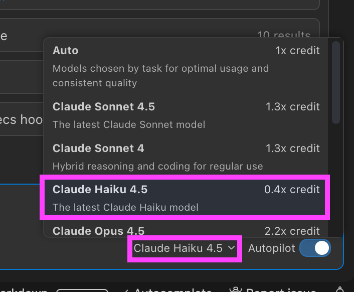
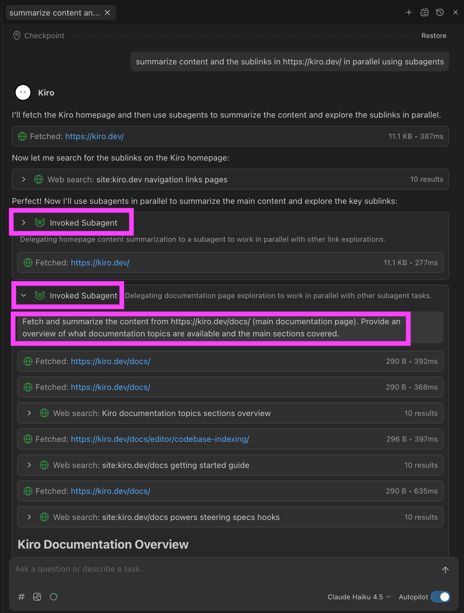

# Lab 2 - Kiro Subagents 

https://github.com/user-attachments/assets/dffbd37b-793a-4fa7-8edf-70918d075b2d

Learn how to use Kiro's subagents to run multiple tasks in parallel and delegate work to specialized agents.

### Prerequisites

- Kiro IDE installed

### Time Required

~10 minutes


## What are Subagents?

Subagents allow Kiro to run multiple tasks in parallel or delegate specific tasks to specialized agents. Each subagent operates with its own context window, keeping the main agent context clean and focused.

### Built-in Subagents

Kiro includes two built-in subagents:

1. **Context Gatherer** - Explores projects and gathers relevant context
2. **General-Purpose Agent** - Handles parallelizing tasks and general work

### Key Benefits

- Run multiple tasks simultaneously and complete work faster
- Delegate complex tasks to specialized agents
- Keep main agent context focused
- Live progress tracking
- Extend context window limits without summarization

## How to Use Subagents

### Automatic Launch
Kiro automatically launches subagents when appropriate for the task.

### Manual Launch
Instruct Kiro directly with prompts like:
- "Run subagents to..."
- "Use subagents to analyze..."
- "Delegate this task using subagents..."

## Workshop Exercise

### Prerequisites
- Kiro IDE installed
- Autopilot mode enabled (subagents require Autopilot)

### Step 1: Switch Model to Claude Haiku 4.5

Select **Claude Haiku 4.5** for faster, cost-effective subagent execution


### Step 2: Try the Example Prompt

Copy and paste this prompt into Kiro chat:

```
summarize content and the sublinks in https://kiro.dev/ in parallel using subagents
```



When you run this prompt, Kiro will:

1. **Spawn multiple subagents** - Each subagent fetches and processes different pages
2. **Work in parallel** - All subagents run simultaneously
3. **Aggregate results** - The main agent collects and summarizes findings
4. **Return consolidated output** - You get a unified summary of all content

### Expected Output

You'll see:
- Live progress tracking as each subagent works
- Individual summaries from each sublink
- A consolidated overview of the Kiro website content

## Use Cases for Subagents

| Use Case | Description |
|----------|-------------|
| Multi-source research | Investigate multiple data sources simultaneously |
| Repository analysis | Analyze GitHub issues across repositories |
| Documentation review | Process multiple docs in parallel |
| Code exploration | Gather context from different parts of a codebase |
| Web scraping | Fetch and summarize multiple URLs at once |

## Tips for Effective Subagent Usage

1. **Be explicit** - Tell Kiro when you want parallel execution
2. **Break down tasks** - Complex tasks benefit from delegation
3. **Use for independent work** - Subagents work best on tasks that don't depend on each other
4. **Monitor progress** - Watch the live tracking to understand what's happening

## Additional Resources

- [Kiro Subagents Documentation](https://kiro.dev/docs/chat/subagents/)
- [Kiro Changelog - Subagents Release](https://kiro.dev/changelog/web-tools-subagents-contextual-hooks-and-per-file-code-review)

---
