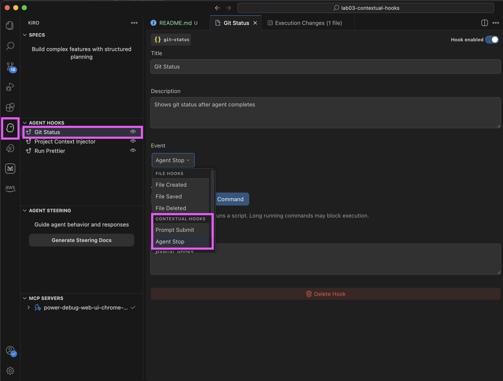
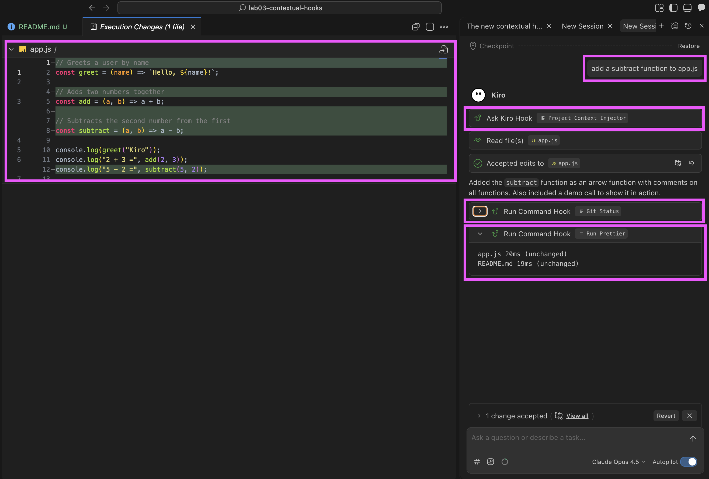

# Lab 3 - Kiro Contextual Hooks

A simple tutorial demonstrating Kiro's **Contextual Hooks** feature.



### Prerequisites

- Kiro IDE installed

### Time Required

~5 minutes


## What are Contextual Hooks?

Contextual hooks fire at key moments in the agent workflow:

- **Prompt Submit** (`promptSubmit`) - Fires when you send a message, before the agent starts
- **Agent Stop** (`agentStop`) - Fires when the agent completes its task

Each hook can perform:

- **sendMessage** - Inject instructions to the agent (uses credits)
- **runCommand** - Run shell commands locally (free)

---

## Try it out

This hook automatically injects coding conventions before the agent works. Ask Kiro to 

```text
add a subtract function to app.js
```

**Result**



---

## Hook Format Reference

| when.type      | Fires                 |
| -------------- | --------------------- |
| `promptSubmit` | Before agent starts   |
| `agentStop`    | After agent completes |

| then.type     | Action                             |
| ------------- | ---------------------------------- |
| `sendMessage` | Inject instructions (uses credits) |
| `runCommand`  | Run shell command (free)           |

---

## Quick Start

1. Open this folder in Kiro
2. Check the hooks in `.kiro/hooks/`
3. Try asking Kiro to modify `app.js`
4. Watch the hooks fire automatically!


