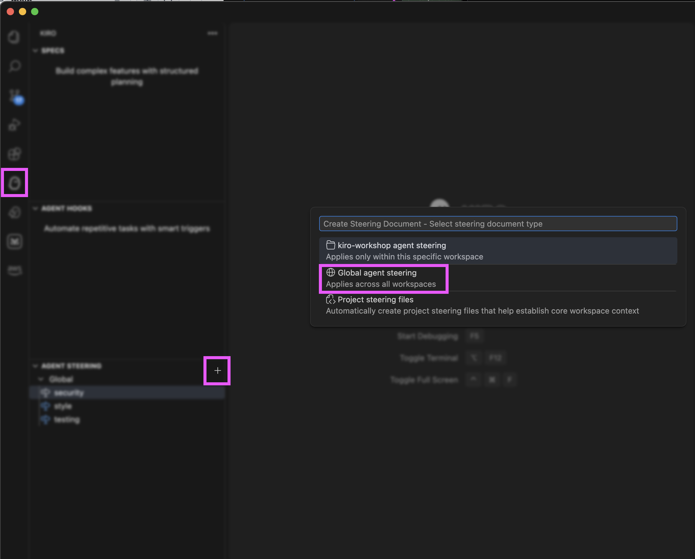
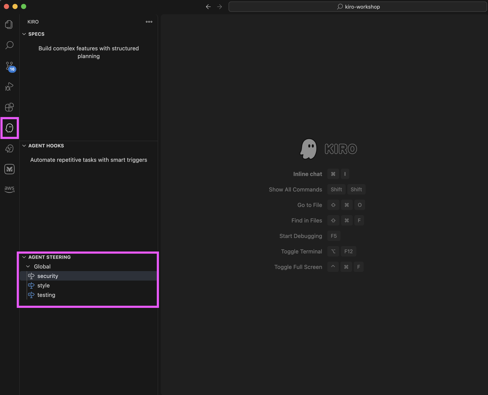

# Lab 4 - Kiro Global Steering

Learn how to use **Global Steering** to define your coding preferences once and have them apply across all your projects automatically.

### Prerequisites

- Kiro IDE installed

### Time Required

~10 minutes

---

## The Problem

You've told your AI assistant dozens of times that you prefer functional React components, use Prettier with semicolons, and put test files in `__tests__` directories. Every new project starts from zero — the AI doesn't remember your preferences.

**Global Steering solves this.**

Think of it as your personal `.bashrc` for AI context — configuration that follows you everywhere, ready when you need it, without the repetition.

---

## What is Steering?

Steering is **persistent AI context**. It's a set of markdown files that tell AI agents about your preferences, standards, and decisions before they start working.

### Two Types of Steering

| Type | Location | Scope |
|------|----------|-------|
| **Workspace Steering** | `<project>/.kiro/steering/` | Project-specific |
| **Global Steering** | `~/.kiro/steering/` | All projects |

Global steering applies to every project unless overridden at the workspace level.

---

## What Belongs in Global Steering?

Think about what's consistent across your work:

- 🎨 **Personal Coding Style** — Formatting, naming conventions
- 🧪 **Testing Philosophy** — Coverage requirements, test file locations
- 🔒 **Security Requirements** — Input validation, authentication patterns
- 📝 **Documentation Standards** — Comment styles, README templates
- 🏗️ **Architecture Principles** — Design patterns, folder structures

---

## Workshop Exercise

### Step 1: Create Your Global Steering Directory

Open your terminal and create the global steering folder:

```bash
mkdir -p ~/.kiro/steering
```

### Step 2: Create Your Global Steering File


For example, create `security`, `style`, `testing` steering file.





Check the `examples` directory for steering example.

### Step 2: Test Your Global Steering

1. Open any project in Kiro
2. Ask Kiro to create a new component or function
3. Observe that Kiro follows your style preferences automatically!

**Example prompt:**
```
Create a utility function that validates email addresses
```

Kiro should now follow your coding style and testing standards without you mentioning them.

---

## Real-World Scenarios

### Team Setup

Organizations can distribute global steering files to ensure consistency:

1. **Git Repository** — Maintain steering files in a shared repo
2. **Symlinks** — Link from `~/.kiro/steering/` to the cloned repo
3. **MDM Deployment** — Use Jamf/Intune to deploy files automatically

Example team structure:
```
# Team-specific and company-wide (in global steering)
~/.kiro/steering/
├── security.md          # ✅ Company security (symlinked from central location)
├── compliance.md        # ✅ SOC2/GDPR (symlinked from central location)
├── code-review.md       # ✅ PR standards (symlinked from central location)
├── react-patterns.md    # ✅ Frontend team React conventions
├── component-api.md     # ✅ Team prop patterns
├── style.md             # ✅ John's personal style preferences
└── shortcuts.md         # ✅ John's custom snippets

# Project-specific (current workspace)
<project>/.kiro/steering/
├── product.md           # ✅ This product's requirements
├── tech.md              # ✅ This project's stack
└── structure.md         # ✅ This codebase's layout
```

---

## Precedence Rules

When both global and workspace steering exist:

1. **Workspace steering takes precedence** for conflicts
2. **Global steering applies** when no workspace override exists
3. **Both are read** — they complement each other

---

## What NOT to Put in Steering

⚠️ **Never include:**
- API keys or secrets
- Database credentials
- Internal URLs or endpoints
- Customer data or PII
- Proprietary algorithms (if sharing files)

Steering files are plain text markdown — treat them as public.

---

## Tips for Effective Global Steering

1. **Start small** — Add one file for your most repeated preference
2. **Expand gradually** — Add more files as you notice patterns
3. **Be specific** — Vague instructions lead to inconsistent results
4. **Review periodically** — Update as your preferences evolve
5. **Use workspace steering for overrides** — Project-specific needs go there

---

## Quick Reference

| Action | Command |
|--------|---------|
| Create global steering folder | `mkdir -p ~/.kiro/steering` |
| List your steering files | `ls ~/.kiro/steering/` |
| Edit a steering file | Open `~/.kiro/steering/<file>.md` in any editor |

---

## Additional Resources

- [Kiro Steering Documentation](https://kiro.dev/docs/steering/)
- [Stop Repeating Yourself Blog Post](https://kiro.dev/blog/stop-repeating-yourself/)
- [Use Inclusion mode to optimize context](https://kiro.dev/docs/steering/#inclusion-modes)
---

## What You Learned

In this lab, you:

1. **Understood the problem** — Repetitive context setting across projects
2. **Created global steering** — Set up `~/.kiro/steering/` with your preferences
3. **Tested it** — Verified Kiro follows your standards automatically
4. **Learned best practices** — What to include and what to avoid

Now your AI assistant finally understands you from day one, every single time.
